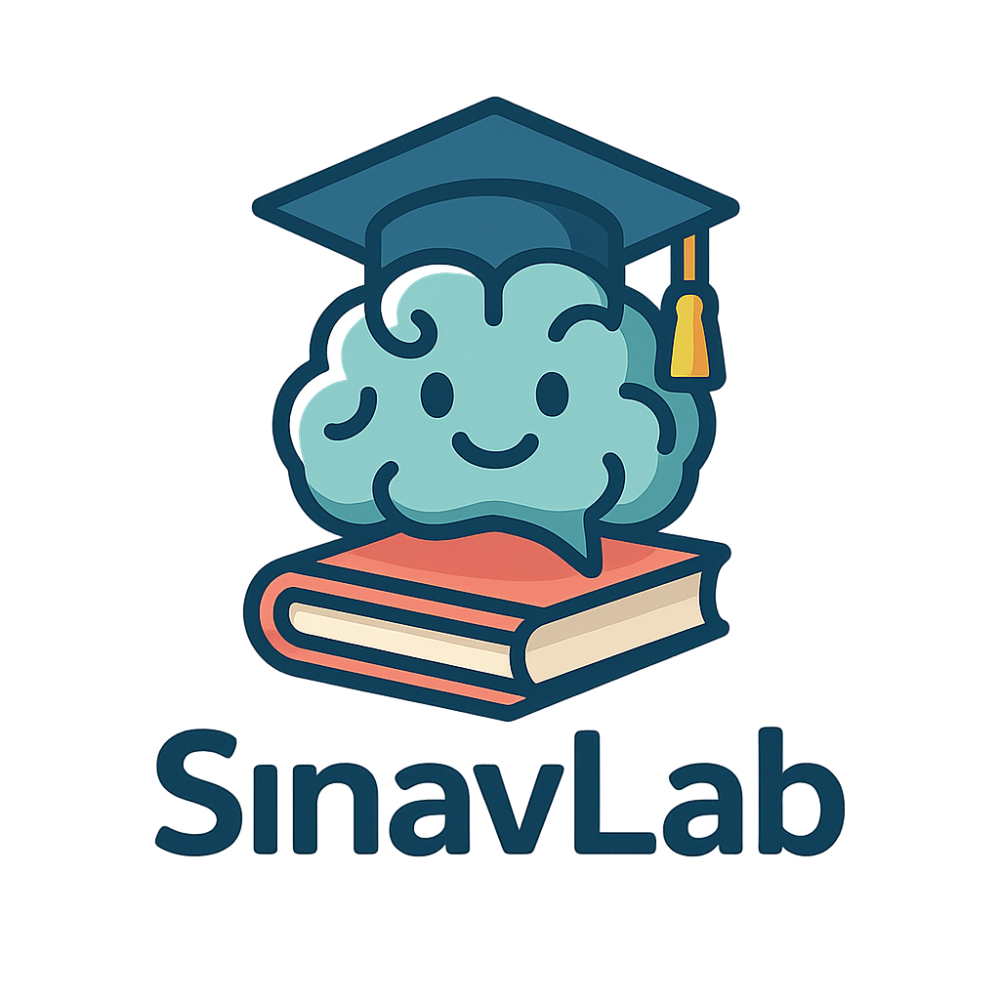
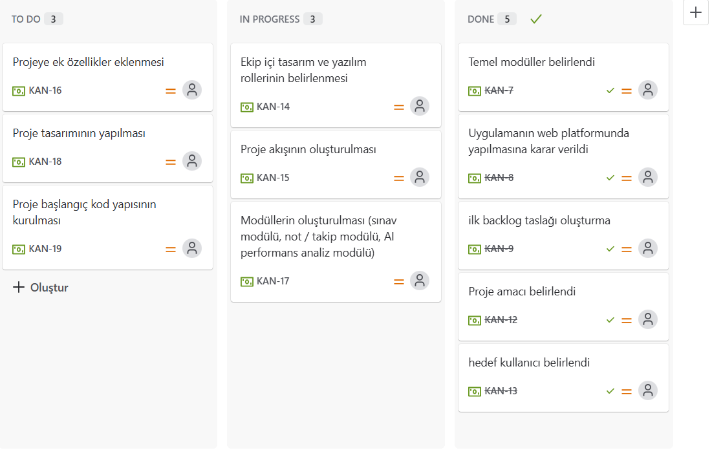
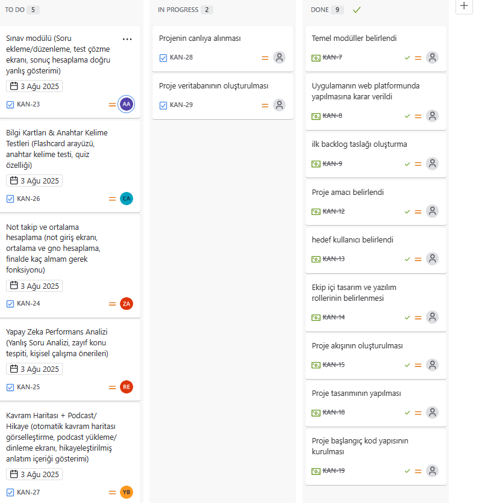

# Takım ismi 
SınavLab - Yapay Zekâ Destekli Kişiselleştirilmiş Sınav ve Öğrenme Platformu

## Takım logosu 

## 👥 Takım Üyeleri

| İsim                                      | Rol                        |
|-------------------------------------------|-----------------------------|
| **Ceylin Akgül**                          | Product Owner, Developer   |
| **Zeynep Açıkgöz**                        | Scrum Master, Developer    |
| **Anas Eskander Mohammed Thabet Al-Maqtari** | Developer                |
| **Rubina Erin**                           | Developer                  |
| **Yavuz Alp Beydoğan**                    | Developer                  |

## Proje Açıklaması
SınavLab, öğrencilere sınavlara hazırlık süreçlerinde kişisel eksiklerini tespit ederek, yapay zekâ destekli sınavlar ve çalışma planları sunmayı hedefler. Sadece sınav çözme değil, konuların kalıcı öğrenilmesini sağlayacak interaktif öğrenme yolları sunar.

## Proje Özellikleri
* Kullanıcıların sınav ve not bilgilerini girerek performanslarını takip edebilmesi
* Yapay zekâ ile çıkabilecek soru tiplerinin tahmini ve kişisel sınav üretimi
* Yanlış yapılan sorulara göre çalışma planı ve tekrar önerileri
* Otomatik kavram/zihin haritası ve bilgi ağacı oluşturma
* Bilgi kartları, podcast anlatımları, hikayeleştirilmiş konu anlatımları

## Hedef Kitle
Öğrenciler, öğretmenler ve sınava hazırlık yapan bireyler

---
# SPRINT 1
---

### 📌 Sprint-1 Notları
Sprint 1 kapsamında projenin temel planlama ve mimari kararları üzerinde çalışılmıştır.
User Story'ler product backlog item'larının içine yazılmıştır ve her bir item’a tıklanarak detaylı hikaye ve kabul kriterleri incelenebilmektedir.

### 🎯 Tahmin Edilen puan ve Tamamlanan puan
- Toplam 300 puanlık bir backlog oluşturulmuştur.
- İlk sprint için hedeflenen puan 100’dür ve planlanan görev dağılımı bu hedefe göre yapılmıştır.
- Proje 3 sprint üzerinden planlanmıştır ve her sprint için yaklaşık 100 puanlık iş yükü hedeflenmiştir.
- Sprint 1 ağırlıklı olarak analiz, planlama ve ilk yapı kurulumuna odaklanmıştır.

### 📈 Puan Tamamlama Mantığı
Sprint 1’deki 100 puanlık iş yükü, projenin temelini oluşturacak analiz ve planlama aşamalarını içermektedir. Bu sprintte yazılım geliştirme sürecinden önce yapılması gereken stratejik adımlar dikkate alınmıştır:

Görev	Puan
Proje fikrinin netleştirilmesi ve kapsam tanımlaması	20
Hedef kitle analizi ve kullanıcı ihtiyaçlarının belirlenmesi	15
MVP (Minimum Viable Product) belirlenmesi	15
Proje modüllerinin belirlenmesi ve görev dağılımı yapılması	20
Sprint planlarının ve roadmap’in oluşturulması	15
Teknoloji ve mimari kararların alınması	15

🔹 Toplam: 100 puan

Sprint 1 sonunda tüm planlama ve ön hazırlık süreçleri tamamlanmış, sonraki sprintlerde yazılım geliştirme aşamasına geçmek için gerekli zemin hazırlanmıştır.

### 🛠 Backlog düzeni ve story seçimleri
Backlog’ta yer alan işler bir sonraki sprintlerdeki yazılım geliştirme ve tasarım süreçlerinin temelini oluşturacak şekilde seçilmiştir.

### 🌟 Sprint Review
Tüm ekip Sprint 1 sonunda yapılan çalışmaları değerlendirmiştir.
Ana kararların netleştiği ve Sprint 2 için kodlama ve tasarım sürecinin zemininin hazırlandığı görüşülmüştür.
Projenin web platformunda geliştirilmesi kararı, modül yapısı ve temel akış ekibin ortak onayıyla netleşmiştir.

----
# SPRINT 2
----

### 📌 Sprint-2 Notları 
Sprint 2 kapsamında proje geliştirme sürecine geçilmiş, teknik altyapı kurulmuş ve proje canlı ortama alınmıştır. Görev dağılımı yapılarak ekip üyeleri kendi modülleri üzerinde çalışmaya başlamıştır.

### 🎯 Tahmin Edilen puan ve Tamamlanan puan
- Bu sprintte toplam **100 puanlık** bir iş yükü planlanmıştır.  
- Sprint 2’nin ana odak noktaları:
  - Veritabanı kurulumu  
  - Projenin canlıya alınması  
  - Ekip içi görev dağılımı  
  - Geliştirme aşamalarının planlanması

### 📈 Puan Tamamlama Mantığı
Sprint 2’deki 100 puanlık iş yükü, projenin ilk çalışan prototipini ortaya çıkaracak teknik geliştirmeleri kapsar. Bu aşamada projenin altyapısı kurulmuş ve sistem canlı ortama alınmıştır.

Görev	Puan
Veritabanı tasarımı ve kurulumu	20
Projenin canlıya alınması ve temel deploy işlemleri	25
Ekip içi görev dağılımının yapılması	20
Frontend ve Backend iskelet yapılarının oluşturulması	20
İlk testler ve prototip çıktısı	15

🔹 Toplam: 100 puan

Sprint 2 sonunda proje canlıya taşınmış, ilk çalışan sürüm elde edilmiştir ve her ekip üyesi kendi modülü üzerinde aktif geliştirmeye başlamıştır.

### 🛠 Backlog Durumu ve İşlerin İlerlemesi  

### 🌟 Sprint Review  
- Sprint sonunda proje ilk kez **canlı ortama taşınmış** ve çalışan bir prototip elde edilmiştir.  
- Ekip görevlerini zamanında ve etkili bir şekilde yerine getirmiştir.  
- Sprint 3 için hedef: kullanıcı testlerini tamamlayarak arayüz ve deneyim geliştirmelerine odaklanmaktır.
