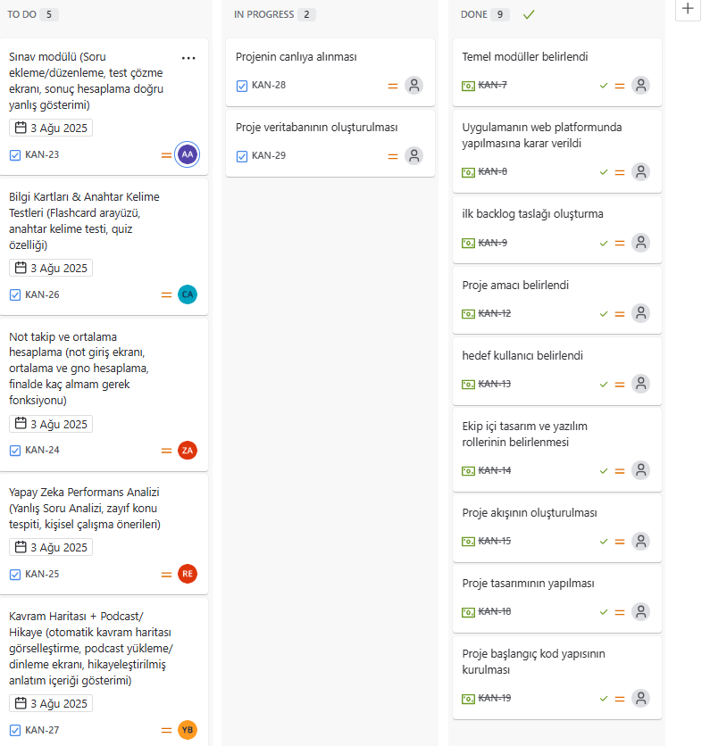

# Takım ismi 
SınavLab - Yapay Zekâ Destekli Kişiselleştirilmiş Sınav ve Öğrenme Platformu

## Takım logosu 

## Takım Üyeleri
* Ceylin Akgül- Product Owner, Developer
* Zeynep Açıkgöz- Scrum Master, Developer
* Anas Eskander Mohammed Thabet Al-Maqtari- Developer
* Rubina Erin- Developer
* Yavuz Alp Beydoğan- Developer

## Proje Açıklaması
SınavLab, öğrencilere sınavlara hazırlık süreçlerinde kişisel eksiklerini tespit ederek, yapay zekâ destekli sınavlar ve çalışma planları sunmayı hedefler. Sadece sınav çözme değil, konuların kalıcı öğrenilmesini sağlayacak interaktif öğrenme yolları sunar.

## Proje Özellikleri
* Kullanıcıların sınav ve not bilgilerini girerek performanslarını takip edebilmesi
* Yapay zekâ ile çıkabilecek soru tiplerinin tahmini ve kişisel sınav üretimi
* Yanlış yapılan sorulara göre çalışma planı ve tekrar önerileri
* Otomatik kavram/zihin haritası ve bilgi ağacı oluşturma
* Bilgi kartları, podcast anlatımları, hikayeleştirilmiş konu anlatımları

## Hedef Kitle
Öğrenciler, öğretmenler ve sınava hazırlık yapan bireyler

---
# SPRINT 1
---

### 📌 Sprint 1 Özeti
Sprint 1 kapsamında projenin temel planlama ve mimari kararları üzerinde çalışılmıştır.
User Story'ler product backlog item'larının içine yazılmıştır ve her bir item’a tıklanarak detaylı hikaye ve kabul kriterleri incelenebilmektedir.

### 🎯 Hedeflenen Puan ve İş Yükü
- Toplam 300 puanlık bir backlog oluşturulmuştur.
- İlk sprint için hedeflenen puan 100’dür ve planlanan görev dağılımı bu hedefe göre yapılmıştır.
- Proje 3 sprint üzerinden planlanmıştır ve her sprint için yaklaşık 100 puanlık iş yükü hedeflenmiştir.
- Sprint 1 ağırlıklı olarak analiz, planlama ve ilk yapı kurulumuna odaklanmıştır.

### 🛠 Backlog düzeni ve story seçimleri
Backlog’ta yer alan işler bir sonraki sprintlerdeki yazılım geliştirme ve tasarım süreçlerinin temelini oluşturacak şekilde seçilmiştir.
Board’daki işler:
✅ Done: Ana hedef ve modül kararları, hedef kullanıcı, platform kararı, ilk backlog taslağı hazırlanmıştır.
⚙️ In Progress: Modüllerin detaylandırılması, proje akışı ve ekip içi roller üzerinde çalışmalar devam etmektedir.
📝 To Do: Kod altyapısının kurulumu ve tasarım süreci Sprint 2’ye hazırlık amacıyla planlanmıştır.

### 🌟 Sprint Review
Tüm ekip Sprint 1 sonunda yapılan çalışmaları değerlendirmiştir.
Ana kararların netleştiği ve Sprint 2 için kodlama ve tasarım sürecinin zemininin hazırlandığı görüşülmüştür.
Projenin web platformunda geliştirilmesi kararı, modül yapısı ve temel akış ekibin ortak onayıyla netleşmiştir.

----
# SPRINT 2
----

### 📌 Sprint 2 Özeti  
Sprint 2 kapsamında proje geliştirme sürecine geçilmiş, teknik altyapı kurulmuş ve proje canlı ortama alınmıştır. Görev dağılımı yapılarak ekip üyeleri kendi modülleri üzerinde çalışmaya başlamıştır.

### 🎯 Hedeflenen Puan ve İş Yükü  
- Bu sprintte toplam **100 puanlık** bir iş yükü planlanmıştır.  
- Sprint 2’nin ana odak noktaları:
  - Veritabanı kurulumu  
  - Projenin canlıya alınması  
  - Ekip içi görev dağılımı  
  - Geliştirme aşamalarının planlanması

### 🛠 Backlog Durumu ve İşlerin İlerlemesi  

### 🌟 Sprint Review  
- Sprint sonunda proje ilk kez **canlı ortama taşınmış** ve çalışan bir prototip elde edilmiştir.  
- Ekip görevlerini zamanında ve etkili bir şekilde yerine getirmiştir.  
- Sprint 3 için hedef: kullanıcı testlerini tamamlayarak arayüz ve deneyim geliştirmelerine odaklanmaktır.
